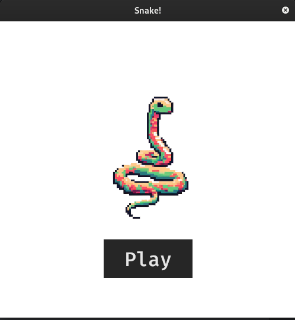
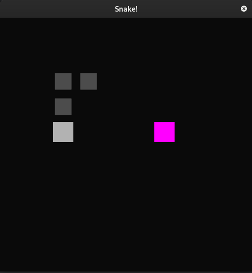
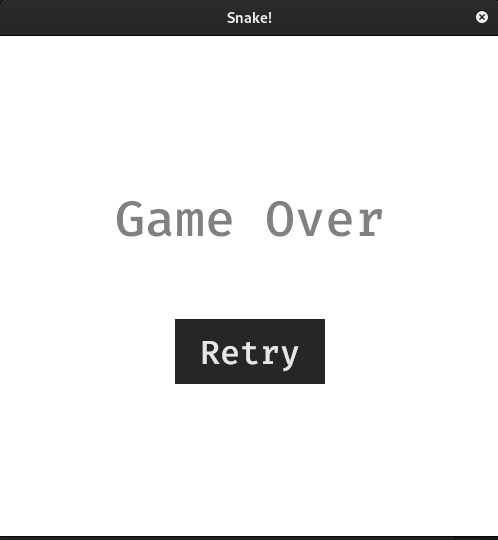

# Snake game made in Rust 

This a simple Snake game made in Rust and based on the tutorial of **marcusbuffet** ( https://github.com/marcusbuffett/bevy_snake )

It was very useful for me to learn Bevy's principles. During learning and extending the practice I have added states (such as Menu, Game and GameOver) to the game.
I also added some UI to make it more user friendly.

Feel free to use it as you want in your learning path.

The images were generated by www.bing.com!

